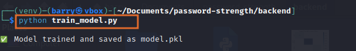
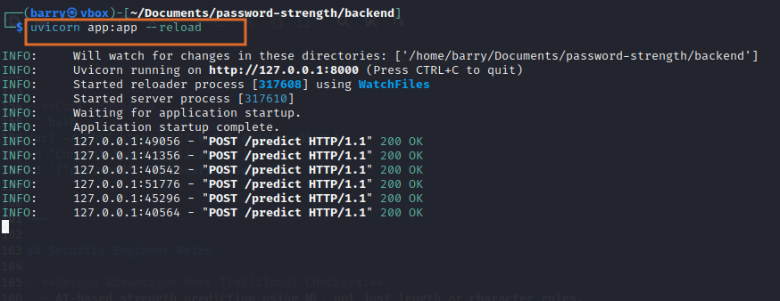
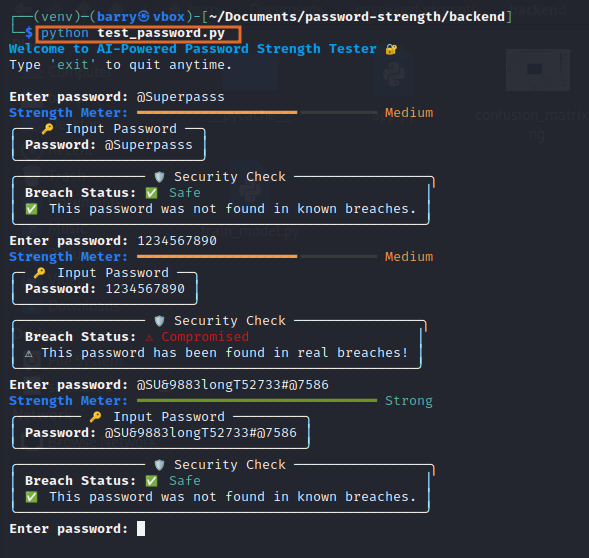

# AI-Powered Password Strength Checker


As a security engineer, I developed this tool to provide real-time insights into password strength and verify if passwords have been compromised in known data breaches. It combines AI-driven password classification with practical breach detection, demonstrating modern cybersecurity practices.


---

## How It Works

1. **Password Analysis & Feature Extraction:**
   - Passwords are first processed to extract **length**, **character variety**, **entropy**, and **common patterns**.
   - These features form the input vector for the ML model.

2. **AI-Powered Classification:**
   - A **decision tree classifier** (or other scikit-learn models) predicts the strength category: Weak (0), Medium (1), or Strong (2).
   - Model is trained on `dataset.csv` (from Kaggle: `soylevbeytullah/password-datas`) and optionally cross-validated for accuracy.

3. **Breach Check Integration:**
   - The tool queries the **HaveIBeenPwned (HIBP) API** or local breach dataset.
   - The password is hashed using SHA-1 and checked against breached password lists.
   - Returns `breached: true` if found in known breaches, otherwise `false`.

4. **Visualization & Feedback:**
   - **CLI:** Persistent, color-coded strength meter bars (Red/Yellow/Green) display strength.
   - **API:** `/predict` endpoint returns a JSON with strength, score, and breach status.
   - User-friendly messages indicate whether passwords are safe or compromised.

<p align="center">
  <a href="https://password-strength-5febfgghoh9qnyatmp3rmn.streamlit.app/">
    
  </a>
</p>

---

## Training the Model

This will:

- Read the password dataset (`dataset.csv`).
- Train the AI model (Decision Tree Classifier).
- Save `model.pkl` in the backend folder.

Once `model.pkl` is created, you can use the CLI tester and API endpoints as usual.

⚠️ If you modify or replace the training dataset, make sure to re-run `train_model.py` to regenerate the model.

---

## Features

- **AI-Powered Password Analysis**
- **Breach Verification via HIBP API**
- **Interactive CLI Dashboard with Persistent Strength Bar**
- **FastAPI Endpoint for Integration**

---

## Datasets Used

- **Password Strength Dataset** (Kaggle): `dataset.csv`
- **Optional Common Password Lists:** RockyOut, etc.

---

## Project Structure

```
password-check/
├─ backend/
│   ├── app.py                        # FastAPI backend serving /predict endpoint
│   ├── password_strength.py           # ML model training & evaluation
│   ├── model.pkl                      # Pre-trained ML model for predictions
│   ├── train_model.py                 # Script to train model and save model.pkl
│   ├── test_password.py               # Interactive CLI tester with persistent strength bar
│   ├── dataset.csv                    # Password dataset for training
│   └── requirements.txt               # Python dependencies
└─ README.md                          # Project documentation
```

---

## Setup Instructions

1. **Clone the repository**
```bash
git clone <https://github.com/abiola-samwel/password-strength>
cd password-strength/backend
```

2. **Create and activate a virtual environment**
```bash
python -m venv venv
source venv/bin/activate    # Linux/macOS
# OR
venv\Scripts\activate       # Windows
```

3. **Install dependencies**
```bash
pip install -r requirements.txt
```

4. **Train the model (if `model.pkl` not included)**
```bash
cd password-strength/backend
python train_model.py
```



5. **Start the FastAPI server**
```bash
cd password-strength/backend
uvicorn app:app --reload
```



---

## CLI Password Tester

1. **Run the interactive tester** (in another terminal)
```bash
cd password-strength/backend
python test_password.py
```



2. **Exit CLI**
- Use `Ctrl+C` or follow on-screen instructions.

## API Usage

- **Endpoint:** `POST /predict`
- **Request Body Example**
```json
{
  "password": "MyS3cur3P@ssw0rd!"
}
```

- **Response Example**
```json
{
  "password": "MyS3cur3P@ssw0rd!",
  "strength": "Strong",
  "strength_score": 2,
  "breached": false,
  "message": "This password was not found in known breaches."
}
```

- **Python Example**
```python
import requests

API_URL = "http://127.0.0.1:8000/predict"
payload = {"password": "MyS3cur3P@ssw0rd!"}
response = requests.post(API_URL, json=payload)
print(response.json())
```

- **Curl Example**
```bash
curl -X POST http://127.0.0.1:8000/predict \
-H "Content-Type: application/json" \
-d '{"password": "MyS3cur3P@ssw0rd!"}'
```

---

## Security Engineer Notes

- **Unique Advantages Over Traditional Checkers:**
  - AI-based strength prediction using ML, not just length or character rules.
  - Breach detection through HIBP or local datasets.
  - Persistent, interactive CLI visualization.
  - API endpoint for real-time validation.

- **Real-World Implementation:**
  - Enterprise IT security, web applications, SaaS platforms, password managers.
  - Security audits and penetration testing.
  - Cybersecurity education and awareness.

- Ensure `model.pkl` is in the project folder for predictions.
- If `model.pkl` is missing, run `train_model.py`.


---

## Open Source Contribution

This project is **open source** and welcomes community contributions. You can:

- Fork the repository and submit improvements.
- Report issues or suggest new features.
- Use it for learning, demo, or integration in other projects.


